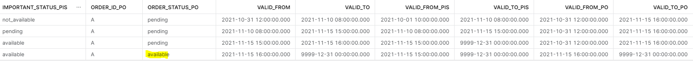
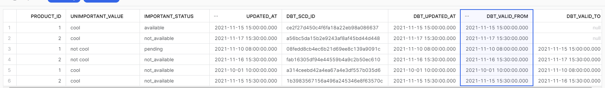

# How to join snapshots in DBT

This repo follows along to the brilliant write ups that Lauren Benezra did over in the [dbt developer blog](https://docs.getdbt.com/blog) so please read the below blogs first!

- [removing partial duplicates](https://docs.getdbt.com/blog/how-we-remove-partial-duplicates)
- [Joining snapshots](https://docs.getdbt.com/blog/joining-snapshot-complexity)

This repo follows the blogs above, and provides a way of seeding some test data into **snowflake**.

Almost all of this documentation is just a copy of Lauren's work.

# Objective of this project

Remove any partital duplicates before joining snapshots.

Join 2 snapshot together to create new data. For example joining our product order and product important status tables will show the product order cant make it to the status available until the the important status is also available (highlighted below in yellow):



# Snapshots

[How to track data changes with dbt snapshots](https://www.getdbt.com/blog/track-data-changes-with-dbt-snapshots/)

## Types of Data

**Mutable:** Records are updated in-place over time. A typical example is an orders table,  where the status column changes as the order is processed.

**Immutable:** Once a record is created, it is never updated again. A typical example is clickstream data, like a page_viewed or link_clicked. Once that event is recorded, it won’t be updated again.

## Why do we need snapshots:

Applications often store data in mutable tables. The engineers that design these applications typically want to read and modify the current state of a row – recording and managing the historical values for every row in a database is extra work that costs brain power and CPU cycles.

## limitations

**snapshotting will not replace having a full history table.**

Snapshots, by their very nature, are not idempotent. The results of a snapshot operation will vary depending on if you run dbt snapshot once per hour or once per day. Further, there’s no way to go back in time and re-snapshot historical data. Once a source record has been mutated, the previous state of that record is effectively lost forever. By snapshotting your sources, you can maximize the amount of data that you track, and in turn, maximize your modeling optionality.


# Partial Duplicates

These special dupes are not the basic ones that have same exact values in every column and duplicate primary keys that can be easily fixed by haphazardly throwing in a distinct.

- You may be capturing historical, type-two slowly changing dimensional data
- incrementally building a table with an append-only strategy, because you actually want to capture some change over time for the entity your recording.
- your loader may just be appending data indiscriminately on a schedule without much care for your time and sanity.

[dbt on partial duplicates removing](https://docs.getdbt.com/blog/how-we-remove-partial-duplicates)

## grain id column

using the macro: `build_key_from_columns` (similar to how we at NBN create a row natural id) to create a unique key for the grain of the table you want to capture.

- **What is the primary key of the entity which you are tacking historical data for?** You should be able to group by this id in order to identify the duplicates for each id.
- **What other column(s) are capturing the changes in the data you want to track in your new model?** These columns will become part of your new unique primary key.
- **What timestamp provides the most reliable update time for these records?** You’ll need this to ensure you’re picking the most recent row among the partial duplicates.
- **What column value(s) are changing, but you don’t care about tracking in your new model?** These are the columns that you’ll ignore when building your grain_id.

The combination of `product_id` + [changing column(s)] you want to capture becomes the grain of your model. In our example, we are looking to capture data at the grain of `entity_important_status` which we'll call our `entity_grain` for now.

## how to remove partial duplicates

After we have the grain id defined simply then remove any duplicates by filtering on just the first occurrence.


# Joining Snapshots

prequisite = removing partial duplicates

[dbt on joining snapshots](https://docs.getdbt.com/blog/joining-snapshot-complexity?utm_content=210039579&utm_medium=social&utm_source=linkedin&hss_channel=lcp-10893210)

Ultimately, our goal is to capture the history for the `product_id` and join the rows that are valid at the same time. As a result, we can get a view of our data at a given point in time that accurately represents the valid state of any given date.

For historical_table_1 and historical_table_2, we will join on `product_id` where historical_table_1.valid_from to historical_table_1.valid_to has overlapping time with historical_table_2.valid_from to historical_table_2.valid_to.


# Example of How to Join Snapshots

We will create 2 different snapshots to simulate transaction with event history and will do this in 2 Remove Partial Duplicates examples.

We will then join these two snapshots at different grains to generate a combined grain where we can see which events were overlapping and which were not.

## Prerequisites

- python and [pipenv](https://pipenv.pypa.io/en/latest/) installed if using dbt cli
- snowflake account [sign up for 1 month free](https://www.snowflake.com/)
- add a profile called dbt_joining_snapshots with your snowflake creds to either [dbt cloud setup](https://docs.getdbt.com/guides/getting-started/getting-set-up/setting-up-snowflake) or via your [dbt cli setup](https://docs.getdbt.com/reference/warehouse-profiles/snowflake-profile)
- create a your user and roles in snowflake. example below:

```sql
USE ROLE ACCOUNTADMIN; -- you need accountadmin (or security admin) for user creation, future grants

DROP USER IF EXISTS DBT_JOINING_SNAPSHOTS_DBT_CLOUD;
DROP ROLE IF EXISTS DBT_JOINING_SNAPSHOTS_TRANSFORMER;
DROP DATABASE IF EXISTS DBT_JOINING_SNAPSHOTS_DATABASE CASCADE;
DROP WAREHOUSE IF EXISTS DBT_JOINING_SNAPSHOTS_TRANSFORMING;

-- creating a warehouse
CREATE WAREHOUSE DBT_JOINING_SNAPSHOTS_TRANSFORMING WITH WAREHOUSE_SIZE = 'XSMALL' WAREHOUSE_TYPE = 'STANDARD' AUTO_SUSPEND = 60 AUTO_RESUME = TRUE COMMENT = 'Warehouse to transform data';

-- creating database
CREATE DATABASE DBT_JOINING_SNAPSHOTS_DATABASE COMMENT = 'your first analytics engineering project';

-- creating an access role
CREATE ROLE DBT_JOINING_SNAPSHOTS_TRANSFORMER COMMENT = 'Role for dbt';

-- granting role permissions
GRANT USAGE,OPERATE ON WAREHOUSE DBT_JOINING_SNAPSHOTS_TRANSFORMING TO ROLE DBT_JOINING_SNAPSHOTS_TRANSFORMER;
GRANT USAGE,CREATE SCHEMA ON DATABASE DBT_JOINING_SNAPSHOTS_DATABASE TO ROLE DBT_JOINING_SNAPSHOTS_TRANSFORMER;


GRANT USAGE ON DATABASE DBT_JOINING_SNAPSHOTS_DATABASE TO ROLE DBT_JOINING_SNAPSHOTS_TRANSFORMER;
GRANT USAGE ON ALL SCHEMAS IN DATABASE DBT_JOINING_SNAPSHOTS_DATABASE TO ROLE DBT_JOINING_SNAPSHOTS_TRANSFORMER;
GRANT SELECT ON ALL TABLES IN DATABASE DBT_JOINING_SNAPSHOTS_DATABASE TO ROLE DBT_JOINING_SNAPSHOTS_TRANSFORMER;

GRANT USAGE ON FUTURE SCHEMAS IN DATABASE DBT_JOINING_SNAPSHOTS_DATABASE TO ROLE DBT_JOINING_SNAPSHOTS_TRANSFORMER;
GRANT SELECT ON FUTURE TABLES IN DATABASE DBT_JOINING_SNAPSHOTS_DATABASE TO ROLE DBT_JOINING_SNAPSHOTS_TRANSFORMER;


-- creating user and associating with role
CREATE USER DBT_JOINING_SNAPSHOTS_DBT_CLOUD PASSWORD='CHANGE_ME_PLEASE' DEFAULT_ROLE = DBT_JOINING_SNAPSHOTS_TRANSFORMER;
-- Make sure you change the above password! Add the flag -- MUST_CHANGE_PASSWORD = true to force a password change too
GRANT ROLE DBT_JOINING_SNAPSHOTS_TRANSFORMER TO USER DBT_JOINING_SNAPSHOTS_DBT_CLOUD;

-- grant all roles to sysadmin (always do this)
GRANT ROLE DBT_JOINING_SNAPSHOTS_TRANSFORMER  TO ROLE SYSADMIN;
```

-- then in your dbt directory in dbt cloud or the cli run **dbt deps** this install the dbt utils library.

```bash
dbt deps
```


... now you can run the below steps...

## Remove Partial Duplicates

We will reproduce mutable data by running the dbt command **dbt seed** several times with different data.

dbt seed will load data into snowflake by mutating the target table. But after each seed we will snapshot the data to record the histroy of these records.

### First get the initial application state into dbt source tables

./seeds/snapshot_example_seeds/product_important_status.csv
```csv
product_id,unimportant_value,important_status,updated_at
1,cool,not_available,2021-10-01 10:00:00
2,cool,not_available,2021-11-15 15:30:00

```

```bash
dbt seed
dbt snapshot
```

### Second update mutable seeds and re run snapshots

./seeds/snapshot_example_seeds/product_important_status.csv
```csv
product_id,unimportant_value,important_status,updated_at
1,not cool,pending,2021-11-10 08:00:00
2,not cool,not_available,2021-11-16 15:30:00

```

```bash
dbt seed
dbt snapshot
```

### Third Update

./seeds/snapshot_example_seeds/product_important_status.csv
```csv
product_id,unimportant_value,important_status,updated_at
1,cool,available,2021-11-15 15:00:00
2,cool,not_available,2021-11-17 15:30:00

```

```bash
dbt seed
dbt snapshot
```

### review your snapshot data

Now take a look at your snapshot tables created:

```sql
select *
from dbt_joining_snapshots_database.snapshots.product_important_status_snapshot
```

notice the new columns capturing when changes happen to DBT_UPDATED_AT, DBT_VALID_FROM, DBT_VALID_TO




### remove partital duplicates

checkout the staging table **stg_product_important_status.sql** built ontop of the snapshot we have just built.

First we create a natural key for the row and hash it with this step:

```jinja2
{{ build_key_from_columns(table_name=ref('product_important_status_snapshot'), exclude=['UNIMPORTANT_VALUE', 'UPDATED_AT','DBT_SCD_ID', 'DBT_UPDATED_AT', 'DBT_VALID_FROM', 'DBT_VALID_TO']) }} as grain_id,
```


then we find only the records with diffs we care about:

```jinja2
, mark_real_diffs as (

  select

      *,
      coalesce(
          lag(grain_id) over (partition by product_id order by updated_at),
          'first_record'
      ) as previous_grain_id,
      case
          when grain_id != previous_grain_id then true 
          else false
      end as is_real_diff

  from grain_id

)
```

## Second Example of Remove Partial Duplicates to be used in snapshot join

This is a repeat of the first example, but we need 2 snapshot to join so doesnt hurt doing a similar example.

### first update
./seeds/snapshot_example_seeds/product_order.csv
```csv
product_id,order_id,product_order_id,order_status,updated_at
1,A,1A,pending,2021-10-31 12:00:00
1,B,1B,pending,2021-11-10 10:00:00
2,C,2C,available,2021-11-10 15:00:00
```

```bash
dbt seed
dbt snapshot
```

### seconds update
./seeds/snapshot_example_seeds/product_order.csv
```csv
product_id,order_id,product_order_id,order_status,updated_at
1,A,1A,available,2021-11-15 16:00:00
1,B,1B,available,2021-11-15 15:30:00
```

```bash
dbt seed
dbt snapshot
```

## Joining snapshots

We take the two snapshots created in the removing partial duplicates examples above:

- dbt_joining_snapshots_database.snapshots.product_important_status_snapshot
- dbt_joining_snapshots_database.snapshots.product_order_snapshot

and join them in **int_product_joined_to_order.sql**

The main part of this is the macro called **join_snapshots** which uses the effective from and to timestamps to join the two different grain events.

Simply run:

```bash
dbt run
```
and review the joined snapshot over in **int_product_joined_to_order**

notice hot the product important status (PIS) and product order (PO) are now joined when then their valid dates overlap.
Its also clear here that the product order cant make it to the status available until the the important status is also available (highlighted below in yellow):


# TODO

## high date from snapshots is null as a result have to manually change it (how to autoamte?)

valid_to uses a high_date instead of the default null that comes from dbt_valid_to. This is enable joining snapshots together based on dates.

```bash
coalesce(dbt_valid_to, cast('{{ var("high_date") }}' as timestamp)) as valid_to
```

## valid_to and valid_from time stamps as the result from join_snapshots are named dynamicallly 

TODO currently have manually check what the names of these columns are e.g.


int_product_joined_to_order.sql

```sql
join_snapshots(...) ...

select 
    ...
    add_product_order_valid_from as valid_from,
    add_product_order_valid_to as valid_to,
```

## build spine part - a bit tricky

This will create duplicates if not careful. You need to make sure you are joining on just the required grain i.e. only the latest record for the grain.
In the below case the grain is product_order_id (but i also needed the join key)

```sql
build_spine as (

    select
        product_important_status.*,
        product_order.product_order_id
    from product_important_status
    left join
       (select product_id, product_order_id from product_order group by 1,2) as product_order 
        on product_important_status.product_id = product_order.product_id
)
```